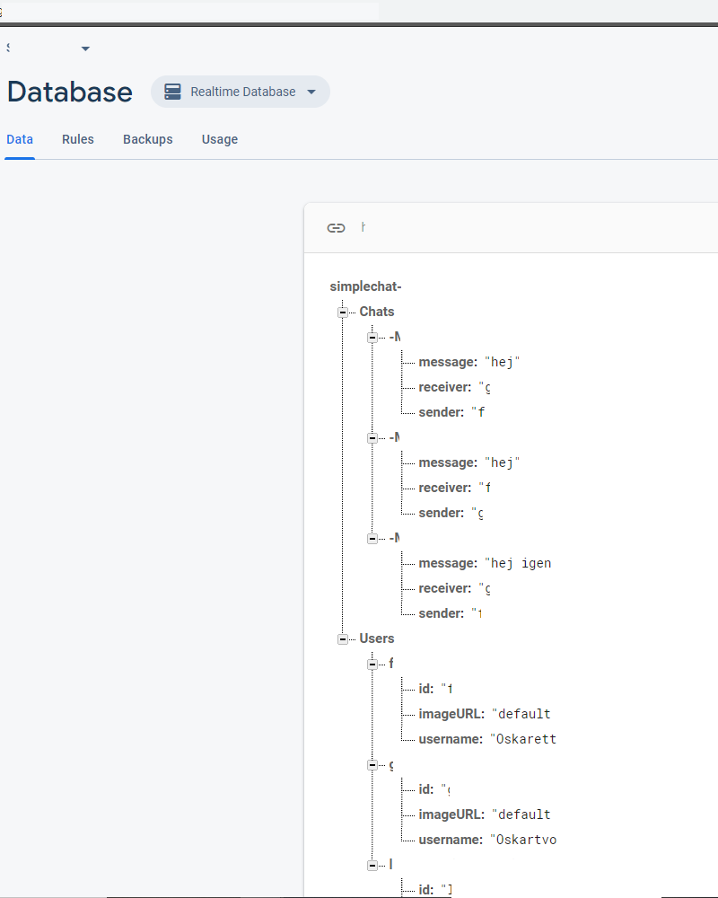

# Android_Studio_SimpleChat

This application is connected with firebase where you login with email authentication in login activity, because of email authentication it also has has a register activity so you can put in username, email and password that is going to be saved in firebase. you can reach both login activity and register activity from start activity. The mainactivity uses a bar for your account information and fragments for user list and chat list with recycler view. When you find other users you can click and open a message activity with same bar layout as main activity but with a recycler fragment for chat items and a bottom for text input and send button. The chat text is stored on firebase and you can access it when you login and see who you chatted with. many problems on the way with androidx migration. there is also a menu item in mainactivity for logout. 

Thanks to google documentation, stackoverflow community, school and guides on blogs and streaming sites helping me reach my goal making this project and learning!
